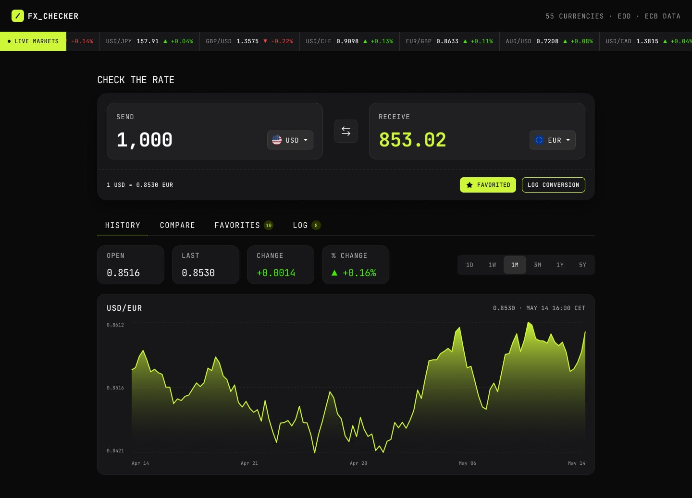
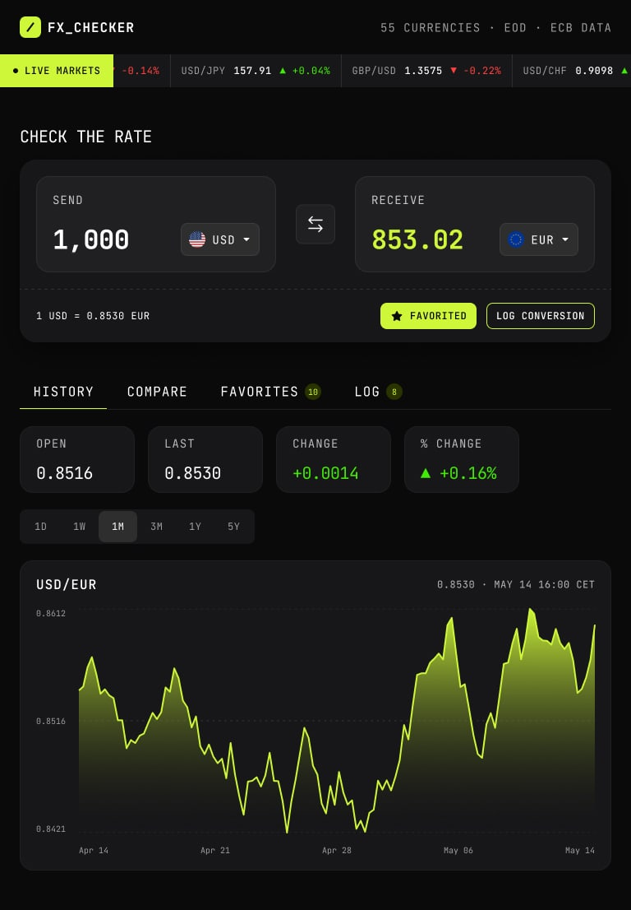
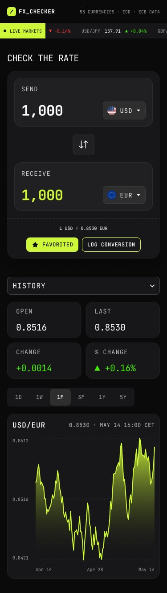

# FX Checker — Currency Converter Dashboard

A real-time currency converter built with React, TypeScript, and the Frankfurter API. Live exchange rates, rate history charts, multi-currency comparison, and persistent favorites & conversion log.

## Table of contents

- [Overview](#overview)
  - [The challenge](#the-challenge)
  - [Screenshot](#screenshot)
  - [Links](#links)
- [My process](#my-process)
  - [Built with](#built-with)
  - [What I learned](#what-i-learned)
  - [Continued development](#continued-development)
  - [Useful resources](#useful-resources)
  - [AI collaboration](#ai-collaboration)
- [Author](#author)

## Overview

### The challenge

Build a currency exchange dashboard that covers the full workflow: convert amounts in real time, visualize rate history on a chart, compare across multiple currencies, and let users save favorites and track their conversion history — all with data from a live API.

Users can:

- Enter an amount and see it convert instantly as they type
- Pick send/receive currencies from a searchable picker with country flags
- Swap currencies with one click
- Favorite a pair and log conversions to history
- View a rate history chart with switchable ranges (1D, 1W, 1M, 3M, 1Y, 5Y)
- See open, last, absolute change, and percentage change for the selected range
- Compare one amount across a range of currencies and pin any row to favorites
- Browse pinned favorites with live rates and load them back into the converter
- Review the conversion log with relative timestamps, delete entries, or clear all
- Navigate entirely by keyboard with visible focus states
- Use the app on mobile, tablet, or desktop with a responsive layout

### Screenshot

| Desktop | Tablet | Mobile |
|---------|--------|--------|
|  |  |  |

### Links

- Solution URL: [https://github.com/AskTiba/fx-checker](https://github.com/AskTiba/fx-checker)
- Live Site URL: [https://fx-checker-phi.vercel.app/](https://fx-checker-phi.vercel.app/)

## My process

### Built with

- [Vite](https://vitejs.dev/) — dev server and build tool
- [React 19](https://react.dev/) — component UI
- [TypeScript](https://www.typescriptlang.org/) — types across API layer, stores, and components
- [Tailwind CSS v4](https://tailwindcss.com/) — utility-first styling with CSS-first configuration
- [Zustand](https://docs.pmnd.rs/zustand/getting-started/introduction) — state management with localStorage middleware
- [Chart.js v4](https://www.chartjs.org/) — line/area charts with gradient fills
- [Frankfurter API](https://frankfurter.dev/) — free exchange-rate data backed by the European Central Bank
- [JetBrains Mono](https://www.jetbrains.com/lp/mono/) — monospace font for rates and financial data

### What I learned

I chose Zustand over Redux or Context because I wanted minimal boilerplate for a dashboard with multiple independent state slices. The `persist` middleware made localStorage trivial — three lines per store and my favorites, log, and active tab all survive browser close.

Chart.js was new to me. The key thing I figured out: register only the components you actually use (`CategoryScale`, `LinearScale`, `PointElement`, `LineElement`, `Filler`), build the chart inside `useEffect`, and always return a cleanup that calls `chart.destroy()`. The gradient fill under the line — which is a key part of the design — uses a `CanvasGradient` that I create from the chart canvas and pass as a plugin.

The Flag component went through a few iterations. Some currencies don't have widely available flag images, so I built a fallback chain: try a local WebP file first, then fetch from flagcdn.com, and if both fail, render the first letter of the currency name in a styled circle. No broken image icons anywhere.

For the mobile tab bar, I used CSS scroll-snap instead of reaching for a carousel library. `scroll-snap-type: x mandatory` on the container and `scroll-snap-align: start` on each tab gives a native swipe feel with zero JavaScript.

One headache: the Frankfurter API migrated from v1 to v2 while I was building this. The endpoint patterns changed and the response shape was different. Having a typed API client with a cache layer meant I only had to update the base URL and one response parser instead of hunting through every component.

### Continued development

I want to add:

- Full accessibility pass — focus management, ARIA live regions for rate updates, screen reader announcements
- Light theme toggle that respects `prefers-color-scheme`
- URL-persisted currency pairs so you can bookmark or share a specific conversion
- CSV export for the conversion log
- Offline fallback — cache the last good rates and show a stale-data banner when the API is down

### Useful resources

- [Frankfurter API docs](https://frankfurter.dev/) — the API I used. Free, no key required, CORS-enabled.
- [Zustand persist middleware docs](https://docs.pmnd.rs/zustand/integrations/persisting-store-data) — how to add localStorage to any store.
- [Chart.js Line Chart docs](https://www.chartjs.org/docs/latest/charts/line.html) — gradient fills and responsive configuration.
- [Tailwind CSS v4 docs](https://tailwindcss.com/docs) — the new `@theme` directive for design tokens.

### AI collaboration

I used **opencode** (an AI coding assistant) throughout this project, guided by the `AGENTS.md` file in the repo. The AI was configured via the Senior Dev Partner skill to act as an **experienced colleague** — presenting options with trade-offs rather than writing code for me, and letting me make the final call on every decision.

**How we worked together, following the protocol:**

- **Architecture discussions.** When I needed to choose a state management approach, the AI laid out Zustand vs Context vs Redux with the trade-offs of each — boilerplate, performance characteristics, learning curve. I picked Zustand based on that conversation. Same for Chart.js vs Recharts, and for the mobile tab pattern (dropdown vs scrollable pills).

- **Implementation.** After I decided on an approach, I worked with the AI to implement it. For example, once I chose Zustand with localStorage persistence, we built the stores together — converter, favorites, log, UI — each as a focused slice with the `persist` middleware.

- **Debugging.** When the Frankfurter API stopped returning data mid-project, the AI pointed me toward the v1→v2 endpoint changes and let me trace through the response shape myself. When Chart.js wasn't rendering, the AI asked what components I'd registered and I found the missing `Filler` import on my own.

- **Code review.** The AI suggested extracting the Flag component when the fallback logic got complex, and asked if I'd considered the edge case where both local and CDN flags fail. I built the initials fallback from there.

- **Testing.** The AI introduced Vitest and showed me the pattern for testing Zustand stores (mock the store, assert state changes). I wrote the 34 tests myself.

**What worked well:** The "trade-offs first" approach meant I understood *why* each library was chosen before writing any code. Cross-file refactors were fast because the AI held the full codebase in context.

**What didn't:** The AGENTS.md instructs the AI not to write complete solutions, but sometimes this slowed things down on straightforward boilerplate (initial Vite config, Tailwind setup) where I would have preferred just getting the code. I had to explicitly say "it's okay to write this one" on those occasions.

## Author

- Website — [https://ask-tiba.vercel.app/](https://ask-tiba.vercel.app/)
- Frontend Mentor — [@AskTiba](https://www.frontendmentor.io/profile/AskTiba)
- LinkedIn — [Anthony Tibamwenda](https://www.linkedin.com/in/anthony-tibamwenda-64144820b/)
